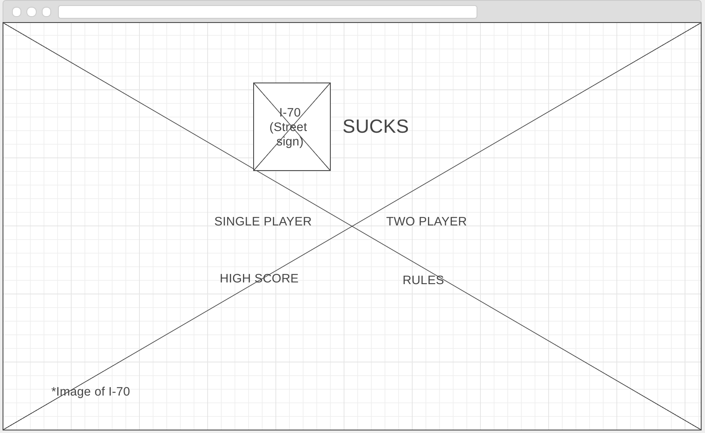
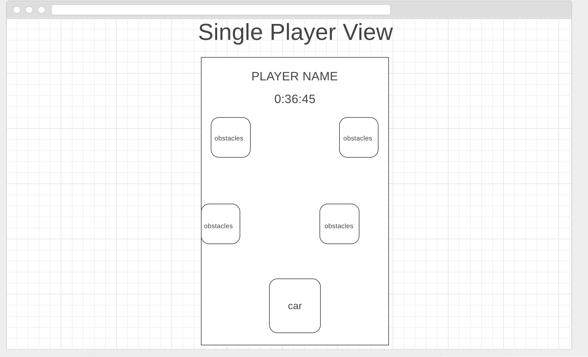
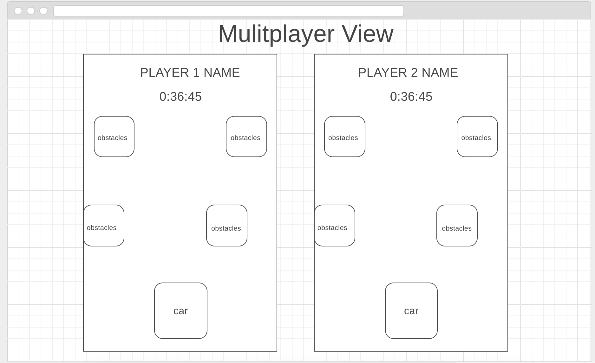
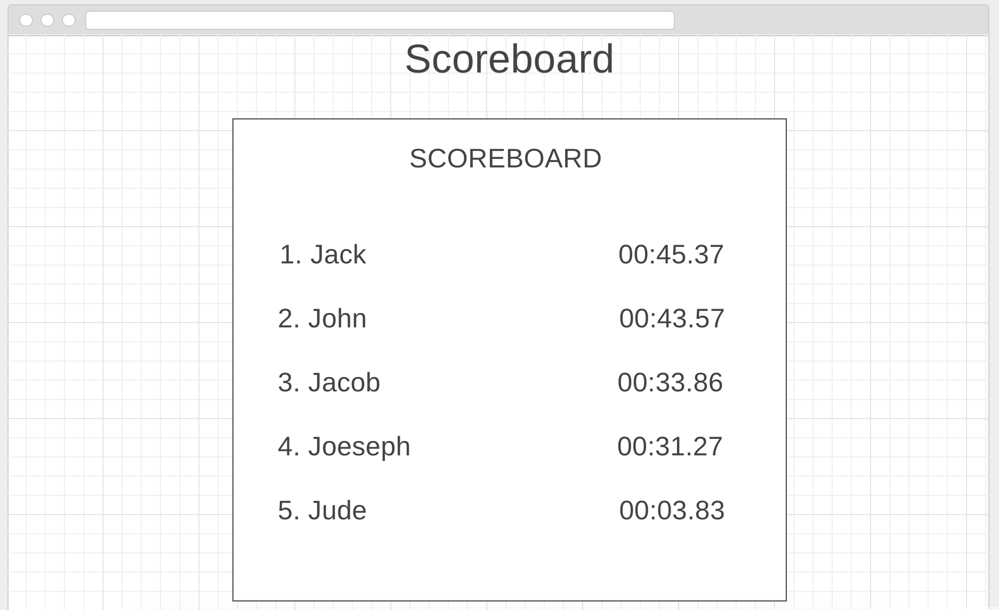

# **Project-1**

# **I-70 SUCKS**: The Game

[Go play it!](https://joshrhughes.github.io/JS-DOM-GAME/)

## What?
A delightful game for all ages that allows the player to relive over and over the never-ending terror of I-70 durring ski season.  

## How? 
By using the "<-" and "->" keys in single player mode and adding the "a" and "d" in two player mode, players move their vehical from lane to lane attempting to avoid obsticles such as slow drivers and Texans. 

## Wireframes

Landing Page   
Single Player    
Multi Player    
Scoreboard    

## What Is Happening? 

In layman's terms, I will have a player "drive" a car to avoid unending obsticls that they will appear to be driving towards.  The driver will stay stagnent while the obsticles "fall" down towards them, similar to Tetris. The game will end when the player "crashes" into another object. 

## Chalenges

 - ~~Will use Phaser framework to set up game physics which I haven't used before.~~
 - Making a scoreboad that stores scores locally.
 - Not sure how to make two player mode happen at the same time with identical obsticles as opposed to Player 1 playing and then player two playing.

## Resources Used

 - Jquery - DOM Manipulation
 - Velocity.js - Smoother animation
 - Google - Everything

## Trello

[My Trello Board](https://trello.com/b/Advm7G6D/project-1-user-stories)

## Requirements
- [x] Render a game in the browser
- [x] Include two players (either two humans, or human and computer)
- [x] Design logic for winning & visually display which player won
- [x] Include separate HTML / CSS / JavaScript files
- [?] Stick with KISS (Keep It Simple Stupid) and DRY (Don't Repeat Yourself) principles
- [x] Use Javascript or jQuery for DOM manipulation
- [x] Deploy your game online, where the rest of the world can access it
- [?] Use semantic markup for HTML and CSS (adhere to best practices)
